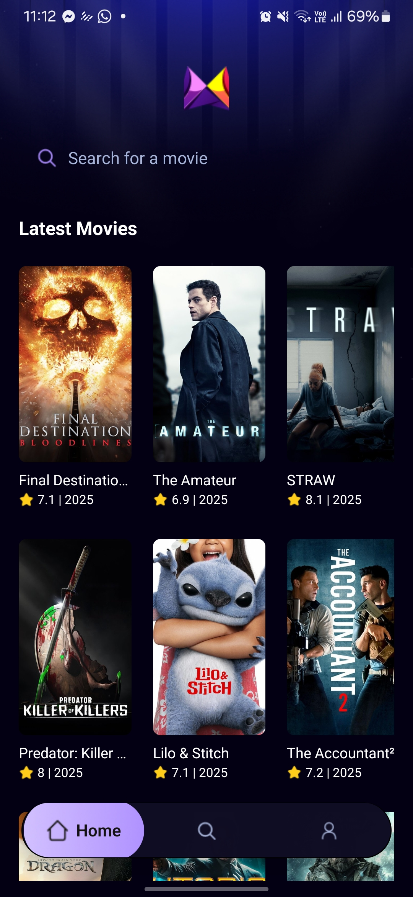
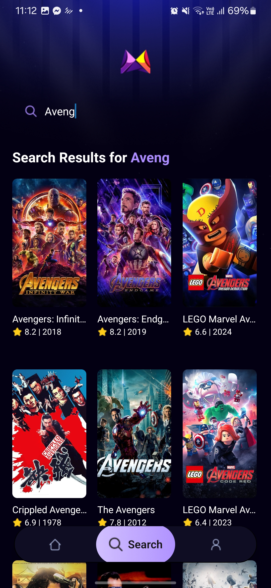
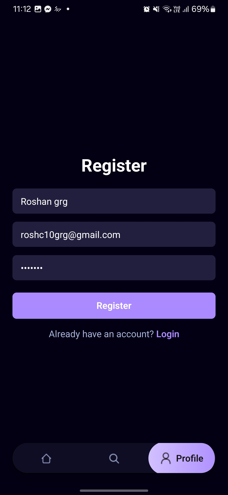

# 🎬 Movie Explorer App

A modern, sleek React Native mobile application built with Expo for discovering and exploring the latest movies. This project serves as a learning playground for React Native development while providing users with a smooth movie browsing experience.

## 📱 Screenshots

| Home Screen | Search Results | User Registration |
|-------------|----------------|-------------------|
|  |  |  |


## ✨ Features

- **🎭 Latest Movies**: Browse the most recent and popular movies
- **🔍 Smart Search**: Real-time movie search with smooth, responsive results
- **⭐ Movie Ratings**: View IMDb ratings and release years for each movie
- **👤 User Authentication**: Register and login functionality
- **🎨 Modern UI**: Clean, dark-themed interface with smooth animations
- **📱 Cross-Platform**: Works on both iOS and Android devices
- **🚀 Fast Performance**: Optimized for smooth scrolling and quick searches

## 🛠️ Tech Stack

- **Framework**: React Native with Expo
- **Language**: TypeScript
- **Styling**: TailwindCSS/NativeWind
- **API**: The Movie Database (TMDB) API
- **Navigation**: Expo Router (file-based routing)
- **Platform**: Mobile (iOS & Android)

## 🚀 Getting Started

### Prerequisites

Make sure you have the following installed:
- [Node.js](https://nodejs.org/) (v16 or higher)
- [Expo CLI](https://docs.expo.dev/get-started/installation/)
- [Git](https://git-scm.com/)

### Installation

1. **Clone the repository**
   ```bash
   git clone https://github.com/Thedraxxx/movie_app.git
   cd movie_app
   ```

2. **Install dependencies**
   ```bash
   npm install
   ```

3. **Set up TMDB API**
   - Get your API key from [The Movie Database](https://www.themoviedb.org/settings/api)
   - Create a `.env` file in the root directory
   - Add your API key:
     ```
     TMDB_API_KEY=your_api_key_here
     ```

4. **Start the development server**
   ```bash
   npx expo start
   ```

5. **Run on your device**
   - Install [Expo Go](https://expo.dev/go) on your mobile device
   - Scan the QR code from the terminal/browser
   - Or run on simulators:
     - **iOS Simulator**: Press `i` in the terminal
     - **Android Emulator**: Press `a` in the terminal

## 🔧 Available Scripts

- `npm start` - Start the Expo development server
- `npm run android` - Run on Android emulator
- `npm run ios` - Run on iOS simulator
- `npm run web` - Run on web browser
- `npm run reset-project` - Reset to blank project
- 
⭐ **If you found this project helpful, please give it a star!** ⭐

*Built with ❤️ using React Native & Expo*
